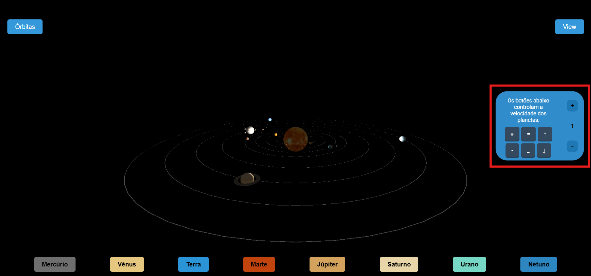
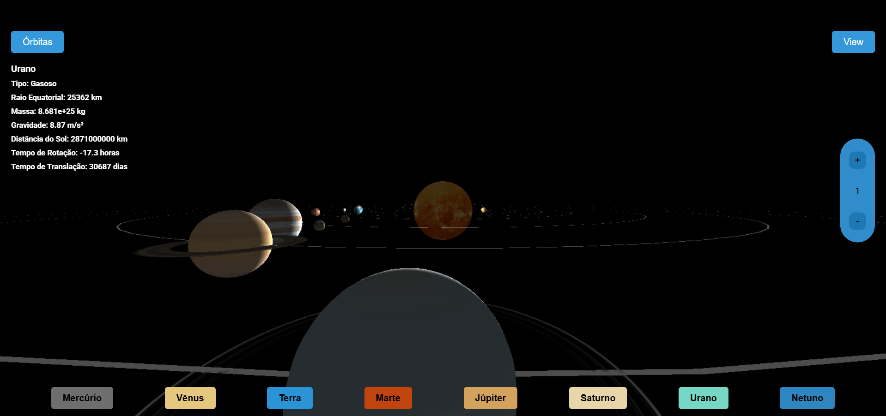
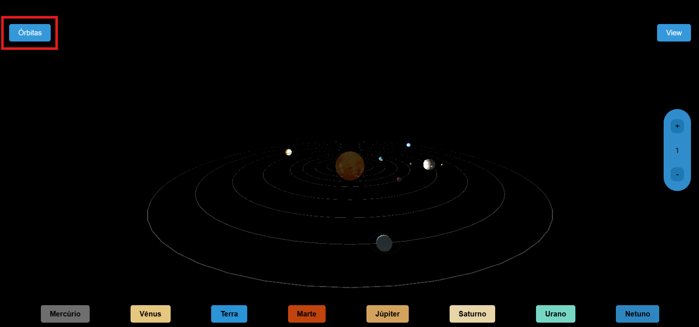

# Sistema Solar 3D - Three.js

Sistema solar feito com Three.js como avaliação para a disciplina de Computação Gráfica no semestre letivo 2024.2

## Autores

- [Ailton Guarinho de Vasconcelos](https://github.com/AkowsS)
- [Francisco Antônio Paiva de Sousa](https://github.com/fcooantonio)
- [Gideão Levi de Oliveira Frota](https://www.github.com/levifrota)
- [Thiago Marques Sousa](https://github.com/thiagomars)
- [Roberto de Andrade](https://github.com/Roberto10Andrade)

## Funcionalidades

- Mudança de velocidade

- Informações dos planetas

- Mostrar e esconder órbitas

### Demonstração

- [Link do vídeo](https://youtu.be/MJVSvTSti24)
